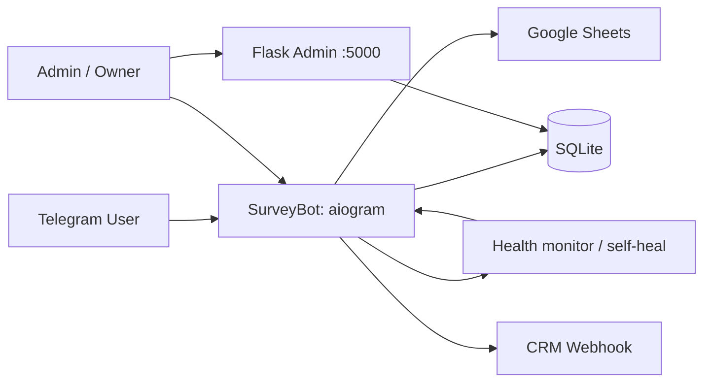

# SurveyBot

[](https://www.python.org/downloads/)
[](https://docs.aiogram.dev/)
[](https://flask.palletsprojects.com/)
[](LICENSE)

**Telegram-бот для анкет и опросов с Flask-админкой и встроенным self-heal.**

| Паспорт | |
|---|---|
| **Уровень** | Level 1 — Simple bot (FSM/handlers, анкеты и роли, без LangGraph) |
| **Статус** | active |
| **Ценность** | Self-hosted опросы в Telegram: создание анкет, ответы, рассылки, веб-экспорт и самодиагностика |
| **Актуализация README** | 2026-08-06 · changelog ниже (`v1.1.0`, 2026-06-19) · [история коммитов](https://github.com/kartuznik/surveyusbot/commits/main) |

Операции (systemd deploy, backup/restore, ротация ключей, инциденты, rollback): [docs/RUNBOOK.md](docs/RUNBOOK.md).

---

## О проекте

**SurveyBot** — portfolio / self-hosted MVP: многофункциональный Telegram-бот для опросов с веб-админкой на Flask, системой ролей, рассылками и **витриной канона самодиагностики** (`/health`, фоновый health-monitor, авто-лечение, systemd restart). Деплой — **venv + systemd** (Docker Compose в репозитории нет).

### Что умеет

- Создание анкет и вопросов прямо в Telegram (текст и выбор).
- Веб-админка на Flask (`:5000`): просмотр ответов, экспорт CSV/PDF, тёмная тема.
- Роли `owner` / `admin` / `user` в SQLite.
- Рассылки `/broadcast` и dry-run `/broadcast_dry` с rate-limit backoff.
- `DEMO_MODE` — фича-режим демо-анкет (не путать с секцией скриншотов «Демо» ниже).
- Self-heal: `/health`, `/diagnostics`, фоновые проверки, уведомления админам, безопасный рестарт.
- Интеграции: CRM webhook, Google Sheets (см. `instructions/`).

### Чего не умеет (честный scope)

- Не multi-tenant SaaS и не enterprise IAM (SSO/SAML).
- Нет LangGraph / multi-agent и нет RAG по базе знаний.
- Нет встроенного стека Prometheus + Grafana.
- Нет приёма платежей (YooKassa и аналоги) — это не магазин.
- Нет Docker Compose quick-start.
- Конкретные коммерческие цены живут **вне** git.

### Поведение при сбоях (graceful degradation / self-heal)

Витрина канона самодиагностики (по факту `bot/health.py` + systemd):

- **`/health` (owner/admin):** снимок — онлайн бота, последняя проверка БД, свободное место на диске, аптайм, критические ошибки.
- **Фоновый monitor:** `check_bot_alive` ~30 с, `check_database` ~60 с, `check_resources` ~5 мин.
- **Авто-лечение:** пересоздание сессии Telegram API; уведомления админам `WARNING` / `RECOVERED`; при неуспехе — WAL checkpoint, pre-crash backup БД и `sys.exit(1)` для подъёма через **systemd** (`Restart=`).
- **StabilityMonitor / ErrorTracker:** учёт ошибок, памяти, latency БД, падений polling; `/diagnostics` для расширенного среза.
- **Веб-админка недоступна:** процесс вебки независим — опросы в Telegram продолжают работать; админ использует команды бота до восстановления `:5000`.

---

## Быстрый старт

```bash
git clone https://github.com/kartuznik/surveyusbot.git SurveyBot
cd SurveyBot
python3 -m venv venv
source venv/bin/activate
pip install -r requirements.txt
# создайте .env (см. таблицу переменных ниже)
python -m bot.main      # терминал 1
python web/app.py       # терминал 2 — админка :5000
```

Через systemd:

```bash
systemctl daemon-reload
systemctl enable --now surveybot
systemctl enable --now surveybot-web
```

Подробности — [docs/RUNBOOK.md](docs/RUNBOOK.md).

---

## Возможности

### Для пользователя (Telegram)

- Прохождение анкет, `/start`, `/help`, `/demo` (демо-анкеты).
- Команда `/demo` доступна всем; демо-анкеты не смешиваются с обычным списком активных анкет.

### Для администратора (Telegram)

- Создание и список анкет, статистика, рассылки (в т.ч. dry-run).
- `/health`, `/diagnostics`, управление ролями owner/admin.
- Экспорт команд, интеграции Sheets/webhook по конфигурации.

### Фича `DEMO_MODE` (не секция скриншотов)

- Включается через `DEMO_MODE=true` в `.env`.
- На старте бот создаёт демо-анкеты.
- Команда `/demo` доступна всем пользователям.
- Демо-анкеты не попадают в обычный список активных анкет для пользователей.

### Веб-админка (`:5000`)

- URL: `http://<YOUR_HOST>:5000/login` (подставьте свой host).
- Пароль из `ADMIN_WEB_PASSWORD` (значение только в `.env`).
- Список анкет и ответов, экспорт CSV; PDF/статистика по возможностям текущей сборки; публичная `/about`.

### Новое в v1.1.0

- `/broadcast_dry`, rate-limit backoff (429), Google Sheets, CRM webhook, PDF stats, `/about`, расширенный `/diagnostics`.

---

## Архитектура



Структура репозитория (ориентир):

```text
SurveyBot/
├── bot/           # handlers, health, locales, main
├── web/           # Flask admin
├── data/          # SQLite
├── scripts/       # check_bot.sh и вспомогательные
├── instructions/  # WEBHOOK_SETUP, GOOGLE_SHEETS_SETUP
├── docs/          # RUNBOOK + demo placeholders
├── config.py
├── database.py
├── LICENSE
└── README.md
```

---

## Демо (скриншоты)

Секция **скриншотов портфолио** — не путать с фичей `DEMO_MODE` / командой `/demo`.

| Плейсхолдер | Сценарий |
|---|---|
| `docs/demo/01-create-survey.png` | Создание анкеты |
| `docs/demo/02-user-answers.png` | Прохождение опроса |
| `docs/demo/03-broadcast.png` | Рассылка / dry-run |
| `docs/demo/04-health.png` | `/health` self-heal снимок |
| `docs/demo/05-web-admin.png` | Веб-админка `:5000` |
| `docs/demo/06-demo-mode.png` | Команда `/demo` при `DEMO_MODE` |

Живой демо-бот: ссылку на `@…` добавляет владелец после публикации.

---

## Переменные окружения

Обязательные:

| Переменная | Назначение |
|---|---|
| `BOT_TOKEN` | Токен Telegram-бота |
| `ADMIN_IDS` | Telegram ID администраторов через запятую |
| `LANGUAGE` | Язык интерфейса (`ru` или `en`) |
| `FLASK_SECRET` | Секрет Flask-сессий |

Рекомендуемые / опциональные:

| Переменная | Назначение |
|---|---|
| `DB_PATH` | Путь к SQLite (по умолчанию `data/surveybot.db`) |
| `ADMIN_WEB_PASSWORD` | Пароль входа в веб-админку |
| `DEMO_MODE` | `true` / `false` — демо-анкеты на старте |
| `OWNER_ID` | Владелец (если пусто — первый из `ADMIN_IDS`) |
| `WEBHOOK_*` / `GOOGLE_SHEETS_*` | Интеграции (см. `instructions/`) |
| `MAX_ERRORS_BEFORE_HEAL` / `MEMORY_LIMIT_MB` / `ENABLE_STABILITY_MONITORING` | Параметры self-heal / stability |

Секреты только в серверном `.env`, не в README.

---

## Команды бота

| Команда | Описание | Доступ |
|---|---|---|
| `/start` | Запустить бота | Все |
| `/help` | Справка по командам | Все |
| `/demo` | Демо-анкеты для покупателей | Все |
| `/create_survey` | Создать анкету | Owner, Admin |
| `/list_surveys` | Показать анкеты | Owner, Admin |
| `/health` | Состояние системы | Owner, Admin |
| `/diagnostics` | Диагностика стабильности | Owner, Admin |
| `/stats` | Статистика | Owner, Admin |
| `/broadcast` | Рассылка | Owner, Admin |
| `/broadcast_dry` | Тестовая рассылка без отправки | Owner, Admin |
| `/setadmin <user_id>` | Назначить администратора | Owner |
| `/removeadmin <user_id>` | Отозвать права администратора | Owner |
| `/admins` | Список owner/admin | Owner |
| `/transferowner <user_id>` | Передать роль владельца | Owner |
| `/setadmin` | Инструкция по BotFather | Все |
| `/export_commands` | Выгрузить `commands.txt` | Все |

## Система ролей

- `owner` — владелец системы, полный контроль прав
- `admin` — администратор, рабочие команды управления ботом
- `user` — обычный пользователь

Роли хранятся в таблице `roles` в SQLite (`user_id`, `role`, `granted_by`, `granted_at`).

Примеры:

- `/setadmin 123456789`
- `/removeadmin 123456789`
- `/admins`

Владелец может отозвать права у администратора в любой момент.

---

## Интеграции

- CRM Webhook: `WEBHOOK_ENABLED`, `WEBHOOK_URL`, `WEBHOOK_SECRET` — `instructions/WEBHOOK_SETUP.md`
- Google Sheets: `GOOGLE_SHEETS_ENABLED`, `GOOGLE_SHEETS_CREDENTIALS`, `GOOGLE_SHEETS_SPREADSHEET_ID` — `instructions/GOOGLE_SHEETS_SETUP.md`

## Диагностика и стабильность

- `StabilityMonitor`: ошибки за час/день, память, среднее время ответа БД, частота падений polling
- `ErrorTracker`: последние ошибки в памяти и `error_log.json`
- При всплеске ошибок — авто-лечение из `health.py`
- `/diagnostics` — расширенный срез стабильности

## Деплой на VPS (systemd)

Юниты:

- `surveybot.service` — Telegram-бот
- `surveybot-web.service` — Flask-админка
- `surveybot-check.timer` + `surveybot-check.service` — периодическая проверка и авто-рекавери

```bash
systemctl status surveybot
systemctl status surveybot-web
systemctl status surveybot-check.timer
```

## Мониторинг

- `journalctl -u surveybot -f`
- `journalctl -u surveybot-web -f`
- `bot_health.log`

Backup SQLite — [docs/RUNBOOK.md](docs/RUNBOOK.md).

---

## FAQ

**Q: Это production-ready enterprise?**  
A: Нет. Это **portfolio / self-hosted MVP** для анкет и опросов.

**Q: Чем «Демо» в README отличается от `DEMO_MODE`?**  
A: Секция «Демо» — плейсхолдеры скриншотов в `docs/demo/`. `DEMO_MODE` / `/demo` — runtime-фича демо-анкет.

**Q: Не видны команды при вводе `/`**  
A: `systemctl restart surveybot`, затем `journalctl -u surveybot -n 50`.

**Q: Нет кнопки меню**  
A: Напишите боту `/start`, перезапустите Telegram-клиент.

**Q: Ошибка входа в веб-админку**  
A: Проверьте `ADMIN_WEB_PASSWORD` в `.env`, перезапустите `surveybot-web` (порт `:5000`).

**Q: Бот не стартует**  
A: Проверьте `BOT_TOKEN`, `journalctl`, backup БД (`DB_PATH`).

**Q: Нет доступа к `/health`**  
A: Пользователь должен быть в `ADMIN_IDS` (или иметь роль admin/owner); перезапустите сервис после правки `.env`.

**Q: Есть ли Docker Compose / Prometheus?**  
A: Нет Compose и нет встроенного Prometheus/Grafana; ops — systemd + `/health` + journalctl.

---

## Лицензирование и коммерческое использование

Базовая лицензия репозитория — **MIT** (см. [LICENSE](LICENSE)): код можно изучать, форкать и запускать self-hosted.

Коммерческие условия и редакции **Starter**, **Team** и **Custom** доступны **по запросу через контакт** (материалы — вне git).

| Редакция | Состав (ориентир) |
|---|---|
| **Community (MIT)** | Self-host анкеты, роли, Flask admin, CSV/PDF export, self-heal `/health` |
| **Starter** | Community + сопровождение внедрения single-tenant demo |
| **Team** | Starter + усиленные ops/алерты/runbook, интеграции Sheets/CRM по договорённости |
| **Custom** | Индивидуальный scope: tenancy, иной стек, локализация доков под клиента |

Конкретные цены живут **вне** git.

## License

MIT — см. [LICENSE](LICENSE).

## Changelog

- `v1.1.0` (2026-06-19): dry-run рассылка, backoff, Google Sheets, webhook CRM, stats PDF, about page, мониторинг стабильности
- `v1.0.0` (2026-06-18): initial release
